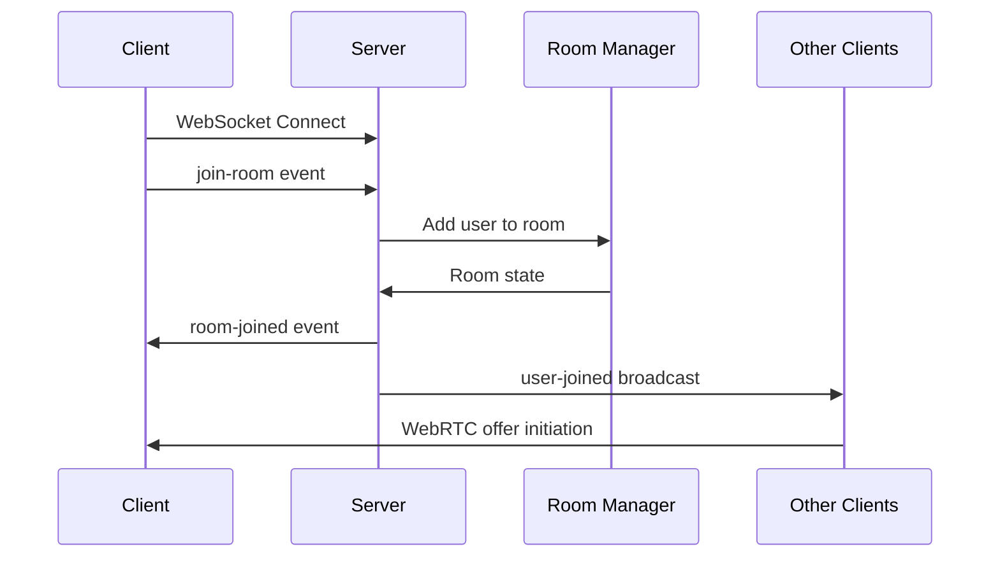
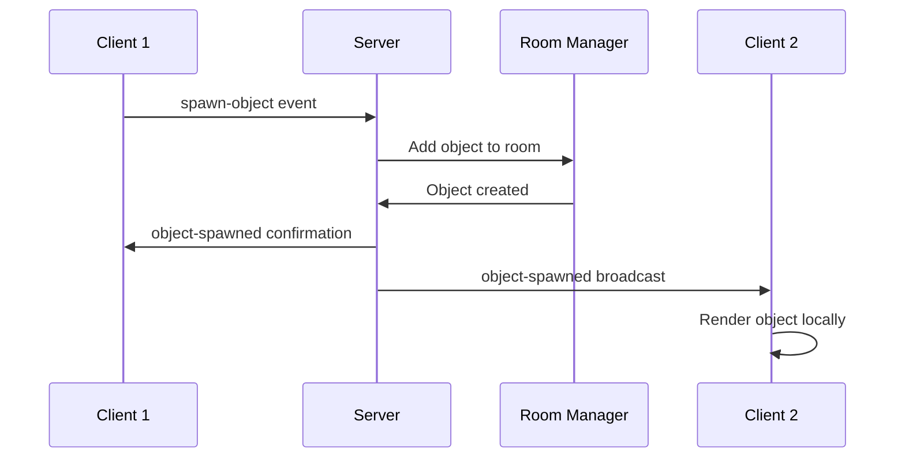
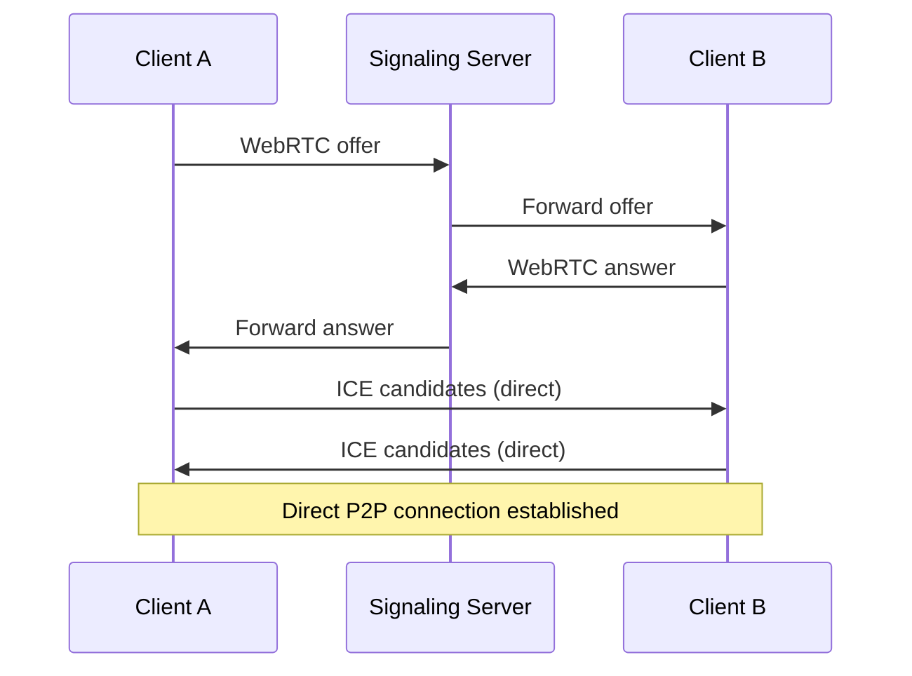

# System Architecture - AR/VR Communication Platform

## Overview

The AR/VR Communication Platform is a distributed system that enables real-time spatial communication across multiple devices and protocols. The architecture follows a hybrid approach combining centralized signaling with peer-to-peer communication for optimal performance and scalability.

## High-Level Architecture

```
┌─────────────────────────────────────────────────────────────────┐
│                        Client Layer                             │
├─────────────────┬─────────────────┬─────────────────────────────┤
│   Web Clients   │  Mobile Apps    │     VR/AR Headsets         │
│                 │                 │                             │
│ ┌─────────────┐ │ ┌─────────────┐ │ ┌─────────────────────────┐ │
│ │ JavaScript  │ │ │   Native    │ │ │      WebXR/Native       │ │
│ │   WebXR     │ │ │   AR/VR     │ │ │       Applications      │ │
│ │ Application │ │ │     Apps    │ │ │                         │ │
│ └─────────────┘ │ └─────────────┘ │ └─────────────────────────┘ │
└─────────────────┴─────────────────┴─────────────────────────────┘
                            │
                   ┌────────┴────────┐
                   │   Load Balancer │
                   └────────┬────────┘
                            │
┌─────────────────────────────────────────────────────────────────┐
│                    Communication Layer                         │
├─────────────────┬─────────────────┬─────────────────────────────┤
│   WebSockets    │   REST APIs     │      WebRTC P2P            │
│                 │                 │                             │
│ ┌─────────────┐ │ ┌─────────────┐ │ ┌─────────────────────────┐ │
│ │ Real-time   │ │ │ HTTP/HTTPS  │ │ │    Direct Peer          │ │
│ │ Signaling   │ │ │  Endpoints  │ │ │   Connections           │ │
│ │ & Events    │ │ │             │ │ │                         │ │
│ └─────────────┘ │ └─────────────┘ │ └─────────────────────────┘ │
└─────────────────┴─────────────────┴─────────────────────────────┘
                            │
┌─────────────────────────────────────────────────────────────────┐
│                     Server Layer                               │
├─────────────────┬─────────────────┬─────────────────────────────┤
│ Signaling Server│  Room Manager   │    Device Discovery         │
│                 │                 │                             │
│ ┌─────────────┐ │ ┌─────────────┐ │ ┌─────────────────────────┐ │
│ │ WebSocket   │ │ │ Virtual     │ │ │   Multi-Protocol        │ │
│ │ Hub         │ │ │ Room State  │ │ │   Device Scanner        │ │
│ │             │ │ │ Management  │ │ │                         │ │
│ └─────────────┘ │ └─────────────┘ │ └─────────────────────────┘ │
└─────────────────┴─────────────────┴─────────────────────────────┘
                            │
┌─────────────────────────────────────────────────────────────────┐
│                     Data Layer                                 │
├─────────────────┬─────────────────┬─────────────────────────────┤
│   In-Memory     │    File System  │      External APIs          │
│                 │                 │                             │
│ ┌─────────────┐ │ ┌─────────────┐ │ ┌─────────────────────────┐ │
│ │ Room State  │ │ │ 3D Models   │ │ │    STUN/TURN            │ │
│ │ User Sessions│ │ │ Assets      │ │ │    Services             │ │
│ │ Device Cache│ │ │ Textures    │ │ │                         │ │
│ └─────────────┘ │ └─────────────┘ │ └─────────────────────────┘ │
└─────────────────┴─────────────────┴─────────────────────────────┘
```

## Core Components

### 1. Client Architecture

#### Web Client Stack
```
┌─────────────────────────────────────┐
│           User Interface            │
│  ┌─────────────────────────────────┐ │
│  │         UI Manager              │ │
│  │ - Modal Management              │ │
│  │ - Notification System           │ │
│  │ - Gesture Recognition          │ │
│  └─────────────────────────────────┘ │
├─────────────────────────────────────┤
│         AR/VR Engine                │
│  ┌─────────────────────────────────┐ │
│  │       WebXR Layer              │ │
│  │ - Session Management           │ │
│  │ - Hand/Eye Tracking           │ │
│  │ - Spatial Mapping             │ │
│  └─────────────────────────────────┘ │
│  ┌─────────────────────────────────┐ │
│  │       Three.js Core            │ │
│  │ - 3D Rendering                │ │
│  │ - Object Management           │ │
│  │ - Scene Graph                 │ │
│  └─────────────────────────────────┘ │
├─────────────────────────────────────┤
│       Communication Layer          │
│  ┌─────────────────────────────────┐ │
│  │      WebRTC Client             │ │
│  │ - Peer Connections            │ │
│  │ - Media Streaming             │ │
│  │ - Data Channels               │ │
│  └─────────────────────────────────┘ │
│  ┌─────────────────────────────────┐ │
│  │     Spatial Audio              │ │
│  │ - 3D Audio Positioning        │ │
│  │ - Room Acoustics              │ │
│  │ - Voice Processing            │ │
│  └─────────────────────────────────┘ │
├─────────────────────────────────────┤
│        Device Integration          │
│  ┌─────────────────────────────────┐ │
│  │    Device Connector            │ │
│  │ - Bluetooth LE                │ │
│  │ - WiFi Direct                 │ │
│  │ - WebUSB                      │ │
│  │ - NFC                         │ │
│  └─────────────────────────────────┘ │
└─────────────────────────────────────┘
```

#### Technology Stack
- **Frontend Framework**: Vanilla JavaScript (ES6+)
- **3D Engine**: Three.js r128
- **AR/VR**: WebXR Device API
- **Communication**: WebRTC, WebSockets
- **Audio**: Web Audio API
- **Device APIs**: Web Bluetooth, WebUSB, NFC API
- **Build Tools**: Rollup, Babel
- **Development**: Local SSL Proxy for HTTPS

### 2. Server Architecture

#### Node.js Server Stack
```
┌─────────────────────────────────────┐
│          API Gateway                │
│  ┌─────────────────────────────────┐ │
│  │        Express.js              │ │
│  │ - REST Endpoints               │ │
│  │ - Middleware Pipeline          │ │
│  │ - Security Headers             │ │
│  └─────────────────────────────────┘ │
├─────────────────────────────────────┤
│       Real-time Layer              │
│  ┌─────────────────────────────────┐ │
│  │       Socket.IO                │ │
│  │ - WebSocket Management         │ │
│  │ - Event Broadcasting           │ │
│  │ - Room Subscriptions           │ │
│  └─────────────────────────────────┘ │
├─────────────────────────────────────┤
│        Business Logic              │
│  ┌─────────────────────────────────┐ │
│  │      Room Manager              │ │
│  │ - Virtual Room State           │ │
│  │ - User Management              │ │
│  │ - Object Synchronization       │ │
│  └─────────────────────────────────┘ │
│  ┌─────────────────────────────────┐ │
│  │   Peer Connection Manager      │ │
│  │ - WebRTC Signaling            │ │
│  │ - ICE Candidate Relay          │ │
│  │ - Connection State Tracking    │ │
│  └─────────────────────────────────┘ │
│  ┌─────────────────────────────────┐ │
│  │    Device Discovery            │ │
│  │ - Protocol Handlers           │ │
│  │ - Device State Management      │ │
│  │ - Command Routing             │ │
│  └─────────────────────────────────┘ │
└─────────────────────────────────────┘
```

#### Technology Stack
- **Runtime**: Node.js 18+
- **Framework**: Express.js
- **Real-time**: Socket.IO
- **Security**: Helmet, CORS
- **Utilities**: UUID, Compression
- **Development**: Nodemon, ESLint

### 3. Data Flow Architecture

#### Message Flow Patterns

**1. Room Join Flow**


**2. Object Spawning Flow**


**3. WebRTC Connection Flow**


### 4. Spatial Computing Architecture

#### AR/VR Processing Pipeline
```
Input Sources → Processing → Rendering → Output
     │              │           │         │
┌────▼────┐    ┌────▼────┐ ┌────▼────┐ ┌──▼──┐
│ Camera  │    │ Spatial │ │ 3D      │ │ HMD │
│ Sensors │───▶│ Mapping │▶│ Engine  │▶│ Web │
│ Touch   │    │ Tracking│ │ Audio   │ │ AR  │
│ Voice   │    │ ML/AI   │ │ Effects │ │     │
└─────────┘    └─────────┘ └─────────┘ └─────┘
```

#### Coordinate Systems
- **World Space**: Global coordinate system for room
- **Local Space**: Individual object coordinate systems  
- **View Space**: Camera/user perspective transforms
- **Device Space**: Physical device sensor coordinates

#### Spatial Synchronization
```javascript
// Position update pipeline
UserInput → LocalTransform → NetworkSync → RemoteRender
    ↓              ↓              ↓            ↓
 Gesture      Apply to       Broadcast    Update Remote
Recognition   Local Object   to Peers     User Avatar
```

### 5. Communication Architecture

#### Protocol Selection Matrix
| Use Case | Protocol | Latency | Bandwidth | Reliability |
|----------|----------|---------|-----------|-------------|
| Signaling | WebSocket | Low | Low | High |
| Voice/Video | WebRTC | Ultra-Low | High | Medium |
| Object Sync | WebSocket | Low | Medium | High |
| Device Control | HTTP/WebSocket | Medium | Low | High |
| File Transfer | WebRTC Data | Low | High | Medium |

#### Network Topology
```
       Internet
          │
    ┌─────┴─────┐
    │   STUN    │
    │ Server    │
    └─────┬─────┘
          │
    ┌─────┴─────┐
    │  Signaling│
    │  Server   │
    └─────┬─────┘
          │
    ┌─────┴─────┐
    │   Clients │
    │    P2P    │
    │  Mesh     │
    └───────────┘
```

#### Peer Connection Management
- **Mesh Topology**: Direct connections between all peers
- **Star Topology**: Hub-and-spoke for large groups (future)
- **Hybrid**: Mesh for small groups, star for overflow

### 6. Device Integration Architecture

#### Multi-Protocol Device Stack
```
┌─────────────────────────────────────┐
│          Application Layer          │
│  ┌─────────────────────────────────┐ │
│  │      Device Commands            │ │
│  │ - Volume Control               │ │
│  │ - Media Playback               │ │
│  │ - Display Control              │ │
│  └─────────────────────────────────┘ │
├─────────────────────────────────────┤
│         Abstraction Layer           │
│  ┌─────────────────────────────────┐ │
│  │    Protocol Handlers           │ │
│  │ - Command Translation          │ │
│  │ - State Management             │ │
│  │ - Error Handling               │ │
│  └─────────────────────────────────┘ │
├─────────────────────────────────────┤
│          Protocol Layer             │
│  ┌───────┬───────┬───────┬───────┐  │
│  │  BLE  │ WiFi  │  NFC  │  USB  │  │
│  │       │Direct │       │       │  │
│  └───────┴───────┴───────┴───────┘  │
└─────────────────────────────────────┘
```

#### Device Discovery Process
1. **Passive Scanning**: Background discovery of available devices
2. **Active Pairing**: User-initiated connection requests
3. **Capability Detection**: Query device features and commands
4. **State Synchronization**: Keep device state in sync across clients

### 7. Security Architecture

#### Security Layers
```
┌─────────────────────────────────────┐
│          Application Security       │
│  ┌─────────────────────────────────┐ │
│  │ - Input Validation             │ │
│  │ - XSS Protection               │ │
│  │ - CSRF Prevention              │ │
│  └─────────────────────────────────┘ │
├─────────────────────────────────────┤
│         Transport Security          │
│  ┌─────────────────────────────────┐ │
│  │ - HTTPS/WSS                    │ │
│  │ - TLS 1.3                      │ │
│  │ - Certificate Pinning          │ │
│  └─────────────────────────────────┘ │
├─────────────────────────────────────┤
│          Network Security           │
│  ┌─────────────────────────────────┐ │
│  │ - DTLS for WebRTC              │ │
│  │ - SRTP for Media               │ │
│  │ - ICE Security                 │ │
│  └─────────────────────────────────┘ │
├─────────────────────────────────────┤
│          Device Security            │
│  ┌─────────────────────────────────┐ │
│  │ - Bluetooth Security           │ │
│  │ - Device Permissions           │ │
│  │ - Capability Restrictions      │ │
│  └─────────────────────────────────┘ │
└─────────────────────────────────────┘
```

#### Privacy Considerations
- **Local-First**: Data processing on device when possible
- **Minimal Data**: Only essential information transmitted
- **User Control**: Granular permissions for all features
- **Encryption**: End-to-end encryption for sensitive data

### 8. Performance Architecture

#### Optimization Strategies

**Client-Side Optimizations**
- **LOD (Level of Detail)**: Adaptive model complexity
- **Frustum Culling**: Only render visible objects
- **Occlusion Culling**: Skip hidden objects
- **Texture Streaming**: Progressive texture loading
- **Audio Optimization**: Spatial audio with distance attenuation

**Server-Side Optimizations**
- **Event Batching**: Combine multiple updates
- **Selective Broadcasting**: Send only relevant updates
- **Connection Pooling**: Efficient resource utilization
- **Caching**: In-memory state caching
- **Rate Limiting**: Prevent resource exhaustion

**Network Optimizations**
- **Delta Compression**: Send only changes
- **Priority Queuing**: Critical updates first
- **Adaptive Bitrate**: Adjust quality based on bandwidth
- **Prediction**: Client-side prediction for smooth experience

#### Performance Monitoring
```javascript
// Key Performance Indicators
const metrics = {
  // Rendering Performance
  fps: 60,                    // Target: 60+ FPS
  frameTime: 16.67,           // Target: <16.67ms
  drawCalls: 50,              // Target: <100
  
  // Network Performance  
  latency: 20,                // Target: <50ms
  bandwidth: 1000,            // Kbps
  packetLoss: 0.1,            // Target: <1%
  
  // System Performance
  memoryUsage: 100,           // MB
  cpuUsage: 30,               // Percentage
  batteryImpact: 'low'        // Target: Low
};
```

### 9. Scalability Architecture

#### Horizontal Scaling Strategy
```
┌─────────────────────────────────────┐
│            Load Balancer            │
│         (Nginx/HAProxy)             │
└─────────────┬───────────────────────┘
              │
    ┌─────────┼─────────┐
    │         │         │
┌───▼───┐ ┌───▼───┐ ┌───▼───┐
│Server │ │Server │ │Server │
│  #1   │ │  #2   │ │  #3   │
└───────┘ └───────┘ └───────┘
    │         │         │
    └─────────┼─────────┘
              │
      ┌───────▼───────┐
      │  Shared State │
      │   (Redis)     │
      └───────────────┘
```

#### Scaling Considerations
- **Stateless Servers**: Room state in shared memory
- **Session Affinity**: Users stick to same server instance
- **Geographic Distribution**: Regional server deployment
- **Auto-scaling**: Dynamic resource allocation

### 10. Deployment Architecture

#### Container Architecture
```yaml
# Docker Compose Structure
services:
  web:
    image: ar-vr-platform:latest
    ports:
      - "3000:3000"
      - "8443:8443"
    environment:
      - NODE_ENV=production
      
  redis:
    image: redis:alpine
    ports:
      - "6379:6379"
      
  nginx:
    image: nginx:alpine
    ports:
      - "80:80"
      - "443:443"
    volumes:
      - ./nginx.conf:/etc/nginx/nginx.conf
      - ./ssl:/etc/ssl
```

#### Production Infrastructure
- **Container Orchestration**: Docker Swarm or Kubernetes
- **Service Discovery**: Consul or etcd
- **Monitoring**: Prometheus + Grafana
- **Logging**: ELK Stack (Elasticsearch, Logstash, Kibana)
- **CI/CD**: GitHub Actions or GitLab CI

### 11. Development Architecture

#### Development Workflow
```
┌─────────────┐    ┌─────────────┐    ┌─────────────┐
│   Local     │    │   Staging   │    │ Production  │
│ Development │───▶│ Environment │───▶│ Environment │
│             │    │             │    │             │
│ - Hot Reload│    │ - SSL Certs │    │ - Load      │
│ - Debug     │    │ - Real      │    │   Balanced  │
│ - Testing   │    │   Devices   │    │ - Monitored │
└─────────────┘    └─────────────┘    └─────────────┘
```

#### Testing Strategy
- **Unit Tests**: Individual component testing
- **Integration Tests**: Component interaction testing
- **E2E Tests**: Full user workflow testing
- **Performance Tests**: Load and stress testing
- **Device Tests**: Multi-device compatibility testing

### 12. Future Architecture Considerations

#### Planned Enhancements
- **Microservices**: Break monolith into specialized services
- **Message Queue**: RabbitMQ or Apache Kafka for async processing
- **Database**: PostgreSQL for persistent data storage
- **Machine Learning**: AI-powered spatial understanding
- **Edge Computing**: CDN-based content delivery
- **Blockchain**: Decentralized identity and ownership

#### Technology Roadmap
- **WebAssembly**: High-performance computing modules
- **WebGPU**: Advanced graphics rendering
- **5G Integration**: Ultra-low latency connectivity
- **Cloud Integration**: AWS/Google Cloud services
- **IoT Expansion**: Broader device ecosystem support

---

## Technical Decisions

### Architecture Decision Records (ADRs)

#### ADR-001: WebXR over Native Development
**Decision**: Use WebXR for AR/VR instead of native platform SDKs
**Rationale**: 
- Cross-platform compatibility
- Faster development cycle
- Web-based distribution
- Lower barrier to entry

#### ADR-002: Peer-to-Peer Communication
**Decision**: Use WebRTC for direct peer communication
**Rationale**:
- Reduced server load
- Lower latency
- Better scalability
- Privacy benefits

#### ADR-003: In-Memory State Management
**Decision**: Use in-memory storage for room state
**Rationale**:
- Simplicity for MVP
- Fast access times
- No database dependencies
- Sufficient for current scale

#### ADR-004: Multi-Protocol Device Support
**Decision**: Support multiple device connection protocols
**Rationale**:
- Maximize device compatibility
- Future-proof architecture
- Enhanced user experience
- Competitive advantage

---

## Conclusion

The AR/VR Communication Platform architecture is designed for:
- **Scalability**: Handle growing user base and feature set
- **Performance**: Maintain real-time interaction requirements
- **Extensibility**: Easy addition of new features and protocols
- **Reliability**: Robust error handling and recovery
- **Security**: Protect user data and privacy

The modular design allows for independent development and deployment of components, while the hybrid communication model balances performance with resource efficiency.

For implementation details, see the [API Documentation](API.md) and [Setup Guide](SETUP.md).
